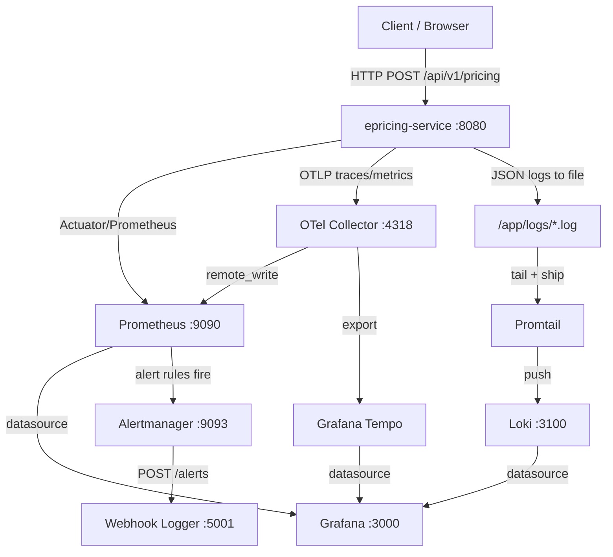

# Bank ePricing Service — Technical Documentation

> **Version:** 1.0.0-SNAPSHOT | **Java:** 21 | **Spring Boot:** 3.3.4

---

## Overview

The **Bank ePricing Service** is a production-grade Spring Boot microservice that calculates loan pricing (interest rate, EMI, eligibility) for multiple banking products. Beyond its core business function, it serves as a **reference implementation** of the full observability stack:

- **Metrics** → Micrometer → Prometheus → Grafana
- **Logs** → Logback (JSON) → Promtail → Loki → Grafana
- **Traces** → OpenTelemetry SDK → OTel Collector → Grafana Tempo

---

## Architecture



---

## Tech Stack

| Layer | Technology | Version |
|---|---|---|
| Runtime | Java | 21 (LTS) |
| Framework | Spring Boot | 3.3.4 |
| Build | Maven | 3.9+ |
| Database | **YugabyteDB (Distributed SQL — YSQL)** / PostgreSQL 16+ | 2.20+ / Managed |
| Migrations | **DatabaseMigrationInitializer** (Sequential V1..V4 scripts) | Enterprise Custom |
| Driver | **Yugabyte Smart Driver (`jdbc-yugabytedb`)** | 42.3.5-yb-4 |
| ORM | Spring Data JPA + Hibernate | Managed |
| Metrics | Micrometer + Prometheus Registry | Managed |
| Tracing | OpenTelemetry SDK + OTLP Exporter | 1.40.0 |
| Logging | Logback + Logstash Encoder | 7.4 |
| Metrics Store | Prometheus | 2.53.0 |
| Log Store | Loki | 3.1.0 |
| Log Shipper | Promtail | 3.1.0 |
| Telemetry Pipeline | OpenTelemetry Collector | 0.107.0 |
| Dashboards | Grafana | 11.1.0 |
| Alert Routing | **Alertmanager** | **0.27.0** |
| Container Metrics | **cAdvisor** | **v0.49.1** |
| Host OS/Hardware Metrics | **Node Exporter** | **v1.8.1** |
| Containers | Docker + Docker Compose | - |

---

## Folder Structure

```
epricing-service/
├── src/main/java/com/bank/epricing/
│   ├── EpricingServiceApplication.java   # Entry point
│   ├── config/                            # Spring config classes
│   ├── controller/                        # REST controllers
│   ├── dto/                               # Request/Response DTOs
│   ├── entity/                            # JPA entities
│   ├── exception/                         # Custom exceptions + handler
│   ├── logging/                           # MDC filter + Structured logger
│   ├── metrics/                           # Custom Micrometer metrics
│   ├── repository/                        # Spring Data JPA repositories
│   ├── service/                           # Business logic services
│   └── util/                              # Pure utility/calculator classes
├── docs/                                  # This documentation
├── grafana/
│   ├── dashboards/
│   │   ├── epricing-complete-dashboard.json          # L3 — 15-panel deep observability
│   │   ├── epricing-l1-operations-dashboard.json     # L1 — CRMNXT-style ops dashboard (NEW)
│   │   ├── log-analysis-dashboard.json               # L2 — Error/warning log analysis
│   │   └── container-nodes-pods-utilization.json     # L4 — CPU/RAM/disk infra
│   └── provisioning/                                 # Auto-provisioned datasources + dashboards
│       └── datasources/datasources.yml               # Prometheus + Loki + YugabyteDB (NEW)
├── prometheus/alerts/                     # Prometheus alerting rules (7 rules)
├── webhook-logger/
│   └── server.py                          # Local alert receiver (prints to console)
├── Dockerfile                             # Multi-stage container build
├── docker-compose.yml                     # Full observability stack (11 services)
├── prometheus.yml                         # Prometheus scrape config + Alertmanager link
├── alertmanager.yml                       # Alert routing — webhook / email / Slack
├── loki-config.yml                        # Loki storage config
├── promtail-config.yml                    # Promtail log shipping config
└── otel-collector-config.yml              # OTel Collector pipeline
```

---

## Quick Start

### Run Tests
```bash
mvn test
```
*Executes all 17 automated tests across `PricingCalculatorTest` (6), `PricingServiceTest` (4), and `PricingControllerTest` (7) covering 200, 201, 400, 404, 422.*

### Local (IDE/Maven)
```bash
mvn spring-boot:run
```
- API: http://localhost:8080/api/v1/pricing
- Health: http://localhost:8080/api/v1/health
- Actuator: http://localhost:8081/actuator
- H2 Console: http://localhost:8080/api/v1/h2-console

### Full Observability Stack (Docker)
```bash
docker-compose up --build
```

| Service | URL |
|---|---|
| ePricing API | http://localhost:8080/api/v1 |
| Actuator / Health | http://localhost:8081/actuator/health |
| Prometheus | http://localhost:9090 |
| Grafana | http://localhost:3000 (admin / Bank@grafana123) |
| **L1 Operations Dashboard** | **http://localhost:3000 → Bank ePricing Monitoring → ePricing L1 Operations Dashboard** |
| Loki | http://localhost:3100 |
| **Alertmanager** | **http://localhost:9093** |
| cAdvisor | http://localhost:8082 |
| Node Exporter | http://localhost:9100 |

> **Watch live alert notifications:**
> ```bash
> docker logs webhook-logger -f
> ```

---

## Key API Endpoints

| Method | URL | Description |
|---|---|---|
| `POST` | `/api/v1/pricing` | Calculate loan pricing |
| `GET` | `/api/v1/pricing?customerId=X` | Get pricing history |
| `GET` | `/api/v1/pricing/{id}` | Get pricing by ID |
| `GET` | `/api/v1/health` | Custom health check |

---

## Documentation Index

| Category | Document |
|---|---|
| Architecture | [SystemOverview.md](./architecture/SystemOverview.md) |
| Services | [PricingService.md](./services/PricingService.md), [PricingAuditService.md](./services/PricingAuditService.md) |
| Controllers | [PricingController.md](./controllers/PricingController.md), [HealthController.md](./controllers/HealthController.md) |
| Entities | [PricingRequest.md](./entities/PricingRequest.md), [PricingAuditLog.md](./entities/PricingAuditLog.md) |
| DTOs | [DTOs.md](./dto/DTOs.md) |
| Repositories | [PricingRepository.md](./repositories/PricingRepository.md), [PricingAuditRepository.md](./repositories/PricingAuditRepository.md) |
| Configuration | [ApplicationConfig.md](./configuration/ApplicationConfig.md), [WebConfig.md](./configuration/WebConfig.md), [OpenTelemetryConfig.md](./configuration/OpenTelemetryConfig.md) |
| Exception Handling | [ExceptionHandling.md](./exception-handling/ExceptionHandling.md) |
| Logging | [LoggingStrategy.md](./logging/LoggingStrategy.md) |
| Monitoring | [Prometheus.md](./monitoring/Prometheus.md), [Grafana.md](./monitoring/Grafana.md), [Loki.md](./monitoring/Loki.md), [OpenTelemetry.md](./monitoring/OpenTelemetry.md), [AlertingRules.md](./monitoring/AlertingRules.md), [Alertmanager.md](./monitoring/Alertmanager.md) |
| **L1 Dashboard** | **[L1_Dashboard.md](./monitoring/L1_Dashboard.md)** — CRMNXT-style ops dashboard, Integration Jobs table, error capture flow |
| Docker | [Dockerfile.md](./docker/Dockerfile.md), [DockerCompose.md](./docker/DockerCompose.md) |
| Utilities | [PricingCalculator.md](./utilities/PricingCalculator.md) |
| Metrics | [PricingMetrics.md](./monitoring/PricingMetrics.md) |
| Features | [PricingEngine.md](./features/PricingEngine.md), [AuditTrail.md](./features/AuditTrail.md), [Observability.md](./features/Observability.md) |
| Testing | [TestStrategy.md](./testing/TestStrategy.md) |
| API Reference | [PricingAPI.md](./api/PricingAPI.md) |
| Database | [DatabaseDesign.md](./database/DatabaseDesign.md) |
| **Production Readiness** | **[PRODUCTION_READINESS.md](./PRODUCTION_READINESS.md)** — What is ready, what is missing, roadmap to production |
