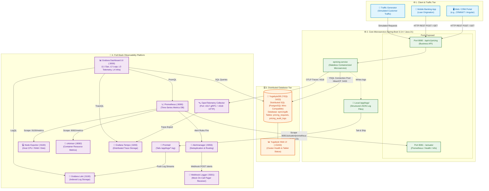
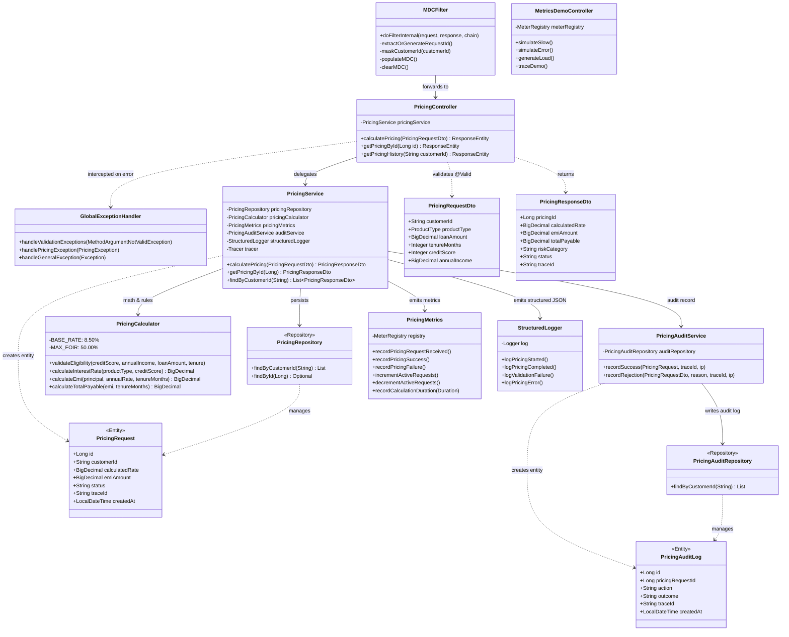
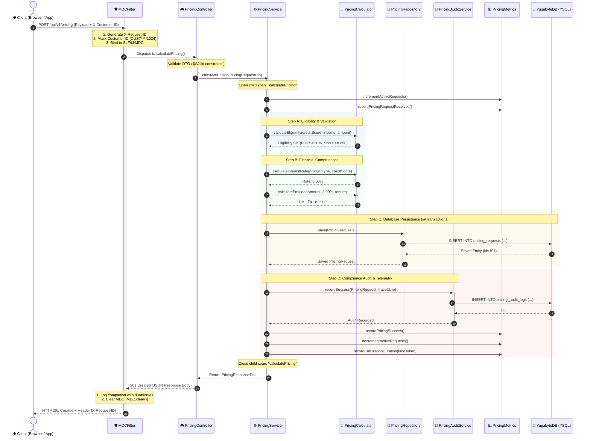
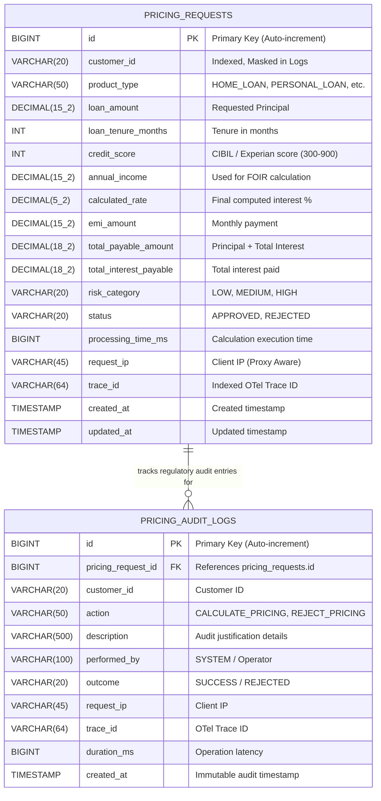

# 🏛️ ePricing Service — Architecture Diagrams (HLD & LLD)

> **Document Type:** System & Component Architecture Specification  
> **Status:** Current & Production Hardened (v1.0.0-SNAPSHOT)  
> **Database:** YugabyteDB (Distributed SQL — YSQL, Port 5433)  
> **Observability:** OpenTelemetry (Traces) + Prometheus (Metrics) + Loki (Logs) + Tempo (Trace Storage) + Grafana (UI)

---

## 1. High-Level Diagram (HLD) — System & Platform Architecture

The **High-Level Diagram** illustrates the entire distributed deployment ecosystem: the ingress tier, the containerized microservice, the distributed database layer, and the multi-component observability platform.

---

## 2. Low-Level Diagram (LLD) — Component Architecture & Internals

The **Low-Level Component Diagram** details the internal Spring Boot modularization, class dependencies, design patterns, and cross-cutting concerns (MDC logging, Micrometer metrics, and OpenTelemetry spans).

---

## 3. Low-Level Sequence Diagram — Single Request Lifecycle

This sequence diagram illustrates the step-by-step execution flow of a loan pricing request through the filter chain, custom OpenTelemetry child spans, calculation engine, database transactions, and telemetry recording.

---

## 4. Low-Level Database Schema (ERD)

---

## Summary of Key Design Highlights for Interviews & Presentations

| Aspect | Implementation Details |
|---|---|
| **Architectural Style** | Domain-centric Layered Microservice with strict unidirectional downward dependency flow. |
| **Concurrency & Transactions** | `@Transactional` on calculation orchestration; HikariCP connection pooling tuned for YugabyteDB. |
| **Distributed Tracing** | 3-tier hierarchy (Controller Root Span $\rightarrow$ Service Child Span $\rightarrow$ Repository Operations). |
| **Observability Pillars** | Correlated via `traceId` across **Prometheus** (Metrics), **Loki** (Logs), and **Tempo** (Traces). |
| **Banking Compliance** | Synchronous immutable audit logging, PII masking in all log output, fail-fast database credentials, and Actuator lockdown. |
