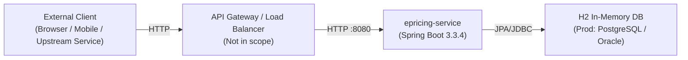
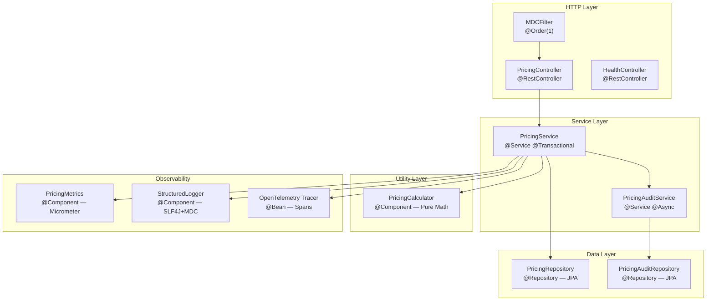
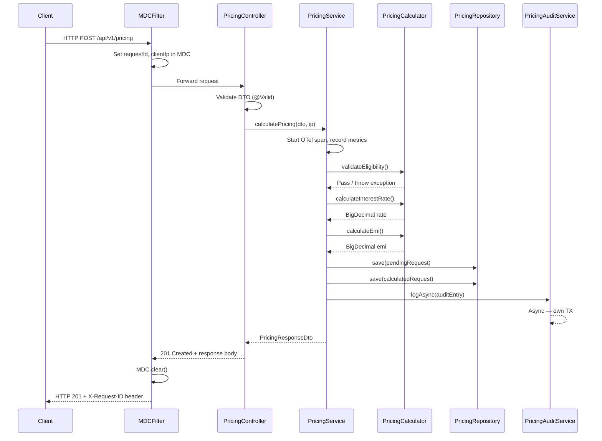
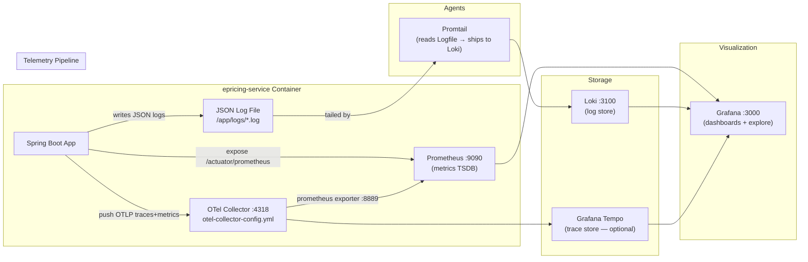

# System Architecture Overview

## Purpose

This document describes the high-level architecture of the Bank ePricing Service — its layers, components, data flows, and the complete observability stack.

---

## System Context

The ePricing Service is a standalone REST microservice that sits within Bank's loan-origination ecosystem. External clients (browser-based dashboards, mobile apps, or upstream services) submit loan pricing requests over HTTP. The service computes interest rates, EMI amounts, and risk categories, persists results, and emits full telemetry (metrics, logs, traces) to the monitoring stack.

---

## Application Layer Architecture

The service uses a strict, unidirectional layered architecture. Dependencies only flow downward.

**Layer responsibilities:**

| Layer | Responsibility |
|---|---|
| **HTTP Layer** | HTTP routing, request/response mapping, MDC population, validation |
| **Service Layer** | Business orchestration, transaction management, async audit dispatch |
| **Utility Layer** | Pure, side-effect-free mathematical calculations |
| **Data Layer** | Persistence — CRUD and domain-specific queries |
| **Observability** | Cross-cutting: metrics recording, structured logging, distributed tracing |

---

## Component Catalog

| Component | Package | Role |
|---|---|---|
| `EpricingServiceApplication` | root | Spring Boot entry point |
| `PricingController` | controller | REST endpoint `/api/v1/pricing` |
| `HealthController` | controller | Custom health/metrics endpoints |
| `PricingService` | service | Core business orchestrator |
| `PricingAuditService` | service | Async, transactionally-isolated audit writer |
| `PricingCalculator` | util | Interest rate, EMI, eligibility logic |
| `PricingMetrics` | metrics | Custom Micrometer metric registration |
| `StructuredLogger` | logging | Typed, structured log event methods |
| `MDCFilter` | logging | Servlet filter populating thread-local log context |
| `GlobalExceptionHandler` | exception | `@RestControllerAdvice` — maps exceptions to HTTP responses |
| `PricingRepository` | repository | JPA repository for `PricingRequest` entity |
| `PricingAuditRepository` | repository | JPA repository for `PricingAuditLog` entity |
| `WebConfig` | config | CORS rules and async thread pool |
| `OpenTelemetryConfig` | config | OTel SDK initialization and `Tracer` bean |

---

## Request Lifecycle

---

## Observability Architecture

The observability strategy is built on three pillars — the **Grafana LGTM stack**.

### Correlation Strategy

All three signals are correlated by a shared **`traceId`**:

1. **MDCFilter** generates a `requestId` and populates MDC.
2. **Micrometer Tracing** automatically puts `traceId` and `spanId` into MDC.
3. **Logback/LogstashEncoder** includes all MDC keys in every JSON log line → Loki indexes `traceId`.
4. **OTel spans** carry the same `traceId` → Grafana Tempo stores them.
5. From any Grafana panel, you can pivot: metric spike → click trace → see all logs with that traceId.

---

## Database Design

Two JPA entities backed by two H2 tables:

| Table | Entity | Purpose |
|---|---|---|
| `pricing_requests` | `PricingRequest` | Primary pricing result and status |
| `pricing_audit_logs` | `PricingAuditLog` | Immutable append-only audit trail |

See [DatabaseDesign.md](../database/DatabaseDesign.md) for schema and ERD.

---

## Security Notes

> **Note:** Authentication and authorization are **not implemented** in this service. In a production deployment the following would be required:
> - JWT token validation (via Spring Security + OAuth2 Resource Server)
> - Role-based access control for admin endpoints
> - TLS on all inter-service communication
> - Actuator endpoints locked behind the management network (port 8081 not public-facing)
> - Secret management via HashiCorp Vault or AWS Secrets Manager

---

## Cross-References

- [PricingService.md](../services/PricingService.md)
- [PricingController.md](../controllers/PricingController.md)
- [OpenTelemetry.md](../monitoring/OpenTelemetry.md)
- [LoggingStrategy.md](../logging/LoggingStrategy.md)
- [DockerCompose.md](../docker/DockerCompose.md)
