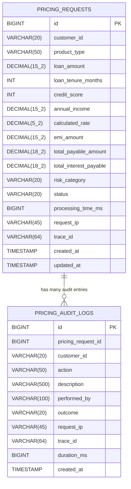

# Database Design

**Database:** YugabyteDB (Distributed SQL — YSQL, Port 5433) / PostgreSQL 16+ | **Driver:** Yugabyte Smart Driver (`jdbc-yugabytedb`)
**Migrations:** Flyway Versioned Migrations (`classpath:db/migration`)
**ORM:** Spring Data JPA + Hibernate (Dialect: `PostgreSQLDialect`, `ddl-auto: validate`)

---

## Entity Relationship Diagram



---

## Table: pricing_requests

**Primary storage** for all loan pricing calculations.

```sql
CREATE TABLE pricing_requests (
    id                    BIGINT         PRIMARY KEY AUTO_INCREMENT,
    customer_id           VARCHAR(20)    NOT NULL,
    product_type          VARCHAR(50)    NOT NULL,
    loan_amount           DECIMAL(15,2)  NOT NULL,
    loan_tenure_months    INT            NOT NULL,
    credit_score          INT,
    annual_income         DECIMAL(15,2),
    calculated_rate       DECIMAL(5,2),   -- e.g., 8.50
    emi_amount            DECIMAL(15,2),
    total_payable_amount  DECIMAL(18,2),
    total_interest_payable DECIMAL(18,2),
    risk_category         VARCHAR(20),    -- LOW, LOW_MEDIUM, MEDIUM, MEDIUM_HIGH, HIGH
    status                VARCHAR(20)    NOT NULL DEFAULT 'PENDING',
    processing_time_ms    BIGINT,
    request_ip            VARCHAR(45),    -- IPv6-safe
    trace_id              VARCHAR(64),
    created_at            TIMESTAMP      NOT NULL DEFAULT CURRENT_TIMESTAMP,
    updated_at            TIMESTAMP      NOT NULL DEFAULT CURRENT_TIMESTAMP
);
```

### Indexes

```sql
CREATE INDEX idx_customer_id ON pricing_requests(customer_id);
CREATE INDEX idx_trace_id    ON pricing_requests(trace_id);
CREATE INDEX idx_status      ON pricing_requests(status);
CREATE INDEX idx_created_at  ON pricing_requests(created_at);
```

| Index | Supports Query |
|---|---|
| `idx_customer_id` | `findByCustomerId()` — customer history lookup |
| `idx_trace_id` | `findByTraceId()` — incident debugging by trace |
| `idx_status` | `countByStatus()` — pipeline status monitoring |
| `idx_created_at` | Time-range queries, recent history (findTop10ByOrderByCreatedAtDesc) |

---

## Table: pricing_audit_logs

**Append-only audit trail** for compliance and investigation.

```sql
CREATE TABLE pricing_audit_logs (
    id                  BIGINT       PRIMARY KEY AUTO_INCREMENT,
    pricing_request_id  BIGINT,      -- Soft FK to pricing_requests.id
    customer_id         VARCHAR(20), -- Denormalized for query efficiency
    action              VARCHAR(50),  -- PRICING_CALCULATED, PRICING_REJECTED, etc.
    description         VARCHAR(500),
    performed_by        VARCHAR(100),
    outcome             VARCHAR(20),  -- SUCCESS, FAILURE, REJECTED
    request_ip          VARCHAR(45),
    trace_id            VARCHAR(64),
    duration_ms         BIGINT,
    created_at          TIMESTAMP    NOT NULL DEFAULT CURRENT_TIMESTAMP
);
```

> **Note:** `pricing_request_id` references `pricing_requests.id` but is a **soft foreign key** (no `FOREIGN KEY CONSTRAINT`). This is intentional: audit logs must be retained even if the source pricing request is purged. A hard FK would prevent deletion of `pricing_requests` records.

---

## Seed Data (`V4__seed_initial_data.sql`)

10 `pricing_requests` and 4 `pricing_audit_logs` are seeded into the database on startup via versioned migration script `V4__seed_initial_data.sql`:

```sql
-- 10 pricing requests covering all product types and statuses
INSERT INTO pricing_requests
  (customer_id, product_type, loan_amount, loan_tenure_months, credit_score, annual_income, ...)
VALUES
  ('CUST001234', 'HOME_LOAN',      5000000.00, 240, 780, 2400000.00, ...),  -- CALCULATED
  ('CUST002345', 'PERSONAL_LOAN',  500000.00,  36,  720, 800000.00,  ...),  -- CALCULATED
  ('CUST003456', 'AUTO_LOAN',      800000.00,  60,  750, 1200000.00, ...),  -- CALCULATED
  ('CUST004567', 'BUSINESS_LOAN',  2000000.00, 84,  810, 3600000.00, ...),  -- APPROVED
  ('CUST005678', 'HOME_LOAN',      3500000.00, 180, 680, 1800000.00, ...),  -- CALCULATED
  ('CUST006789', 'PERSONAL_LOAN',  300000.00,  24,  620, 600000.00,  ...),  -- REJECTED
  ('CUST007890', 'EDUCATION_LOAN', 1200000.00, 120, 740, 1000000.00, ...),  -- CALCULATED
  ('CUST008901', 'HOME_LOAN',      7500000.00, 300, 830, 4800000.00, ...),  -- APPROVED
  ('CUST009012', 'AUTO_LOAN',      600000.00,  48,  700, 900000.00,  ...),  -- CALCULATED
  ('CUST010123', 'BUSINESS_LOAN',  5000000.00, 60,  760, 6000000.00, ...);  -- CALCULATED

-- 4 audit log entries
INSERT INTO pricing_audit_logs (pricing_request_id, customer_id, action, outcome, ...)
VALUES
  (1, 'CUST001234', 'PRICING_CALCULATED', 'SUCCESS',  ...),
  (4, 'CUST004567', 'PRICING_APPROVED',   'SUCCESS',  ...),
  (6, 'CUST006789', 'PRICING_REJECTED',   'REJECTED', ...),
  (8, 'CUST008901', 'PRICING_APPROVED',   'SUCCESS',  ...);
```

---

## Enterprise Migration Runner (`DatabaseMigrationInitializer`)

To support distributed SQL (YugabyteDB) alongside standard PostgreSQL and H2 without monolithic advisory lock contention, the service uses `DatabaseMigrationInitializer` with a dedicated `schema_history` table.

```yaml
spring:
  datasource:
    url: jdbc:yugabytedb://${DB_HOST:localhost}:${DB_PORT:5433}/${DB_NAME:epricingdb}?load-balance=true&sslmode=disable
    driver-class-name: com.yugabyte.Driver
    username: ${DB_USERNAME:yugabyte}
    password: ${DB_PASSWORD:yugabyte}
    hikari:
      pool-name: epricing-pool
      maximum-pool-size: 20
      minimum-idle: 5
      leak-detection-threshold: 60000

  flyway:
    enabled: false    # Migrations executed sequentially by DatabaseMigrationInitializer

  jpa:
    database-platform: org.hibernate.dialect.PostgreSQLDialect
    hibernate:
      ddl-auto: validate      # Strictly validate entities against applied migrations
    show-sql: false
    properties:
      hibernate:
        jdbc:
          batch_size: 50
          order_inserts: true
          order_updates: true
```

### Versioned Migration Scripts

```
src/main/resources/db/migration/
├── V1__create_pricing_requests_table.sql
├── V2__create_pricing_audit_logs_table.sql
├── V3__create_indexes.sql
└── V4__seed_initial_data.sql
```

**Key Safety Features:**
- **Fail-Fast on Failure**: If any migration fails, `DatabaseMigrationInitializer` throws a critical runtime exception, preventing the application from starting in an inconsistent state.
- **Idempotent Tracking**: Applied scripts are recorded in `schema_history(version, description, script, installed_on)`.
- **Strict Validation**: Hibernate's `ddl-auto: validate` guarantees schema consistency while preventing untracked runtime DDL modifications.

---

## Data Types and Precision

**Why BigDecimal / DECIMAL in SQL for financial data?**

`double` and `float` are IEEE 754 floating-point types — they cannot exactly represent decimal fractions. For example:
```java
0.1 + 0.2 == 0.30000000000000004  // IEEE 754 float error
```

In banking, this is unacceptable. `DECIMAL(15,2)` stores exact base-10 values:
```sql
DECIMAL(15,2): up to 15 digits total, 2 after decimal point
-- Example: 9999999999999.99 (13 digits + 2 decimal = 15 digits)
```

---

## Cross-References

- [PricingRequest.md](../entities/PricingRequest.md) — entity mapping
- [PricingAuditLog.md](../entities/PricingAuditLog.md) — audit entity mapping
- [PricingRepository.md](../repositories/PricingRepository.md) — queries on pricing_requests
- [PricingAuditRepository.md](../repositories/PricingAuditRepository.md) — queries on pricing_audit_logs
- [ApplicationConfig.md](../configuration/ApplicationConfig.md) — JPA/HikariCP configuration
