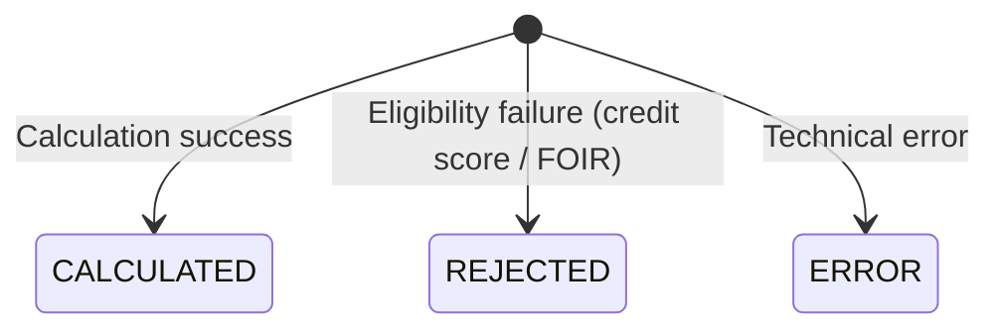

# PricingRequest Entity

**Package:** `com.bank.epricing.entity`
**File:** [`PricingRequest.java`](../../src/main/java/com/bank/epricing/entity/PricingRequest.java)
**JPA Table:** `pricing_requests`

---

## Purpose

`PricingRequest` is the **primary JPA entity**. Each instance represents one loan pricing calculation request and its computed result. It is the central domain object of the ePricing service.

---

## Class Declaration

```java
@Entity
@Table(name = "pricing_requests",
    indexes = {
        @Index(name = "idx_customer_id", columnList = "customer_id"),
        @Index(name = "idx_trace_id", columnList = "trace_id"),
        @Index(name = "idx_status", columnList = "status"),
        @Index(name = "idx_created_at", columnList = "created_at")
    }
)
@Builder
@Data
@NoArgsConstructor
@AllArgsConstructor
public class PricingRequest { ... }
```

---

## Fields

| Field | Column | Type | Constraints | Description |
|---|---|---|---|---|
| `id` | `id` | `Long` | `@Id`, auto-generated | Primary key |
| `customerId` | `customer_id` | `String(20)` | `@NotBlank` | Bank customer identifier |
| `productType` | `product_type` | `String(50)` | `@NotBlank` | Loan type (see below) |
| `loanAmount` | `loan_amount` | `BigDecimal` | `@NotNull`, precision(15,2) | Requested loan amount in INR |
| `loanTenureMonths` | `loan_tenure_months` | `Integer` | `@NotNull` | Repayment period in months |
| `creditScore` | `credit_score` | `Integer` | `@Min(300)`, `@Max(900)` | Applicant's CIBIL credit bureau score |
| `annualIncome` | `annual_income` | `BigDecimal` | `@NotNull`, `@DecimalMin("100000")` | **Required.** Annual income in INR. Used for FOIR eligibility check |
| `calculatedRate` | `calculated_rate` | `BigDecimal` | precision(5,2) | Computed annual interest rate (%) |
| `emiAmount` | `emi_amount` | `BigDecimal` | precision(15,2) | Monthly EMI amount in INR |
| `totalPayableAmount` | `total_payable_amount` | `BigDecimal` | precision(18,2) | Principal + total interest |
| `totalInterestPayable` | `total_interest_payable` | `BigDecimal` | precision(18,2) | Total interest over tenure |
| `riskCategory` | `risk_category` | `String(20)` | — | Risk bucket (see below) |
| `status` | `status` | `Enum(PricingStatus)` | `@Enumerated(STRING)` | Current lifecycle status |
| `processingTimeMs` | `processing_time_ms` | `Long` | — | End-to-end calculation duration |
| `requestIp` | `request_ip` | `String(45)` | — | Client IP address (supports IPv6) |
| `traceId` | `trace_id` | `String(64)` | — | OTel trace ID for cross-signal correlation |
| `createdAt` | `created_at` | `LocalDateTime` | `@CreationTimestamp` | Record creation time |
| `updatedAt` | `updated_at` | `LocalDateTime` | `@UpdateTimestamp` | Last update time |

---

## Nested Enum: `PricingStatus`

```java
public enum PricingStatus {
    CALCULATED,  // Rate and EMI successfully computed
    REJECTED,    // Business rule rejection (credit score, FOIR failure)
    ERROR        // Technical/system error during processing
}
```

> **Why only 3 states?**
> `PENDING` (pre-processing) and `APPROVED` (post-underwriting) were removed.
> This service is a **pricing engine**, not a full Loan Origination System (LOS).
> Approval workflow lives in a separate downstream service. Having unused enum
> values implies an unbuilt workflow and causes confusion during audits.

**Lifecycle transitions:**



---

## Product Types

The `productType` field is a free-form `String`. Valid values used in the system:

| Value | Description |
|---|---|
| `HOME_LOAN` | Residential property loan |
| `PERSONAL_LOAN` | Unsecured personal loan |
| `AUTO_LOAN` | Vehicle purchase loan |
| `BUSINESS_LOAN` | Business / SME loan |
| `EDUCATION_LOAN` | Student education loan |

---

## Risk Categories

Determined by `PricingCalculator.determineRiskCategory()` based on credit score:

| Category | Credit Score Range |
|---|---|
| `LOW` | ≥ 800 |
| `LOW_MEDIUM` | 750 – 799 |
| `MEDIUM` | 700 – 749 |
| `MEDIUM_HIGH` | 650 – 699 |
| `HIGH` | < 650 |

---

## Database Indexes

Four indexes are defined to support the most common query patterns:

| Index | Column | Use Case |
|---|---|---|
| `idx_customer_id` | `customer_id` | `findByCustomerId()` — history lookup |
| `idx_trace_id` | `trace_id` | `findByTraceId()` — incident debugging |
| `idx_status` | `status` | `countByStatus()` — pipeline monitoring |
| `idx_created_at` | `created_at` | Time-range queries and recent history |

---

## JPA Configuration

```yaml
spring:
  jpa:
    hibernate:
      ddl-auto: create-drop      # Schema auto-created on startup
    properties:
      hibernate:
        jdbc:
          batch_size: 20         # Batch inserts for performance
          order_inserts: true    # Sort inserts for batch efficiency
```

- **`create-drop`**: Schema is created on startup and dropped on shutdown. Suitable for development. Use `validate` or `none` in production with a migration tool (Flyway/Liquibase).
- **Batch inserts**: Enabled with `batch_size=20` and `order_inserts=true` for efficient bulk writes.

---

## Seed Data

The migration script `V4__seed_initial_data.sql` populates 10 sample `pricing_requests` rows at startup:

```sql
INSERT INTO pricing_requests
    (customer_id, product_type, loan_amount, credit_score, ...)
VALUES
    ('CUST001234', 'HOME_LOAN', 5000000.00, 780, ...),
    ('CUST002345', 'PERSONAL_LOAN', 500000.00, 720, ...),
    ...
```

See [DatabaseDesign.md](../database/DatabaseDesign.md) for full seed data.

---

## Cross-References

- [PricingRepository.md](../repositories/PricingRepository.md) — queries on this entity
- [PricingService.md](../services/PricingService.md) — entity lifecycle management
- [PricingCalculator.md](../utilities/PricingCalculator.md) — fields set by calculator
- [DatabaseDesign.md](../database/DatabaseDesign.md) — full schema and ERD
