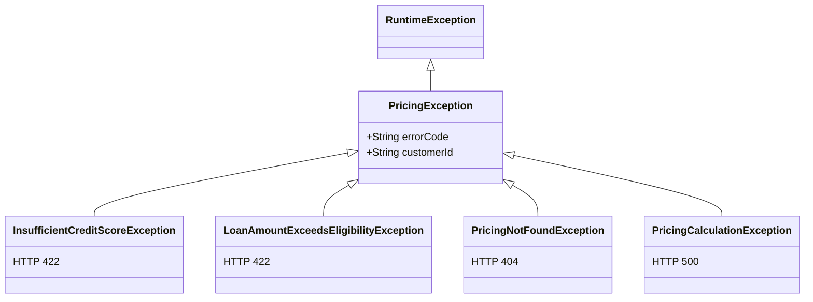

# Exception Handling

**Package:** `com.bank.epricing.exception`
**Files:**
- [`GlobalExceptionHandler.java`](../../src/main/java/com/bank/epricing/exception/GlobalExceptionHandler.java)
- [`PricingException.java`](../../src/main/java/com/bank/epricing/exception/PricingException.java)

---

## Purpose

The exception handling strategy ensures that:

1. **Every exception produces a consistent JSON error response** — no leaking of stack traces or internal details.
2. **Domain exceptions map to appropriate HTTP status codes** — `422` for business violations, `404` for not found, `400` for validation failures.
3. **Observability is maintained** — error events are recorded in metrics and logs.
4. **Client-friendly error codes** — error responses include a typed `error_code` field for programmatic handling.

---

## Exception Hierarchy

`PricingException` is the base class. All domain-specific exceptions extend it:



### Exception Details

| Exception Class | Error Code | HTTP Status | Cause |
|---|---|---|---|
| `InsufficientCreditScoreException` | `INSUFFICIENT_CREDIT_SCORE` | `422 Unprocessable Entity` | Credit score below minimum (650) |
| `LoanAmountExceedsEligibilityException` | `LOAN_AMOUNT_EXCEEDS_ELIGIBILITY` | `422 Unprocessable Entity` | Loan > 60% of annual income |
| `PricingNotFoundException` | `PRICING_NOT_FOUND` | `404 Not Found` | No pricing record for given ID |
| `PricingCalculationException` | `PRICING_CALCULATION_ERROR` | `500 Internal Server Error` | Unexpected mathematical error |

### Base Class `PricingException`

```java
public abstract class PricingException extends RuntimeException {
    private final String errorCode;
    private final String customerId;

    protected PricingException(String message, String errorCode, String customerId) {
        super(message);
        this.errorCode = errorCode;
        this.customerId = customerId;
    }
}
```

All subtypes are `RuntimeException` subclasses — Spring's `@Transactional` rolls back on `RuntimeException` by default.

---

## GlobalExceptionHandler

```java
@RestControllerAdvice
public class GlobalExceptionHandler { ... }
```

`@RestControllerAdvice` is a specialisation of `@ControllerAdvice` that automatically adds `@ResponseBody` to all handler methods — every method returns a JSON body.

### Constructor Dependencies

```java
public GlobalExceptionHandler(MeterRegistry meterRegistry, StructuredLogger structuredLogger)
```

The handler is injected with `MeterRegistry` and `StructuredLogger` to record error metrics and structured log events for every exception.

### Handler Methods

#### `handlePricingNotFoundException` → 404

```java
@ExceptionHandler(PricingException.PricingNotFoundException.class)
@ResponseStatus(HttpStatus.NOT_FOUND)
public ErrorResponse handlePricingNotFoundException(PricingException.PricingNotFoundException ex) {
    structuredLogger.logValidationFailure(ex.getCustomerId(), ex.getMessage());
    return buildErrorResponse(ex.getErrorCode(), ex.getMessage(), HttpStatus.NOT_FOUND);
}
```

---

#### `handleInsufficientCreditScore` → 422

Called when `PricingCalculator.validateEligibility()` rejects a customer due to credit score.

---

#### `handleLoanAmountExceedsEligibility` → 422

Called when the requested loan amount exceeds the customer's eligibility limit.

---

#### `handleValidationException` → 400

Handles `MethodArgumentNotValidException` — thrown by Spring when `@Valid` fails on a DTO field.

```java
@ExceptionHandler(MethodArgumentNotValidException.class)
@ResponseStatus(HttpStatus.BAD_REQUEST)
public ErrorResponse handleValidationException(MethodArgumentNotValidException ex) {
    Map<String, String> fieldErrors = ex.getBindingResult().getFieldErrors()
        .stream()
        .collect(Collectors.toMap(FieldError::getField, FieldError::getDefaultMessage));
    structuredLogger.logValidationFailure(ex.getObjectName(), fieldErrors);
    return buildErrorResponse("PRICING_VALIDATION_FAILED",
        "Request validation failed: " + fieldErrors, HttpStatus.BAD_REQUEST);
}
```

---

#### `handlePricingCalculationException` → 500

Internal system errors. The full `Throwable` is included in the log but **never sent to the client**.

---

#### `handleGenericException` → 500

Catch-all for any unhandled exception:

```java
@ExceptionHandler(Exception.class)
@ResponseStatus(HttpStatus.INTERNAL_SERVER_ERROR)
public ErrorResponse handleGenericException(Exception ex) {
    log.error("Unexpected error", ex);
    return buildErrorResponse("INTERNAL_ERROR", "An unexpected error occurred", HttpStatus.INTERNAL_SERVER_ERROR);
}
```

---

## Error Response Format

All error responses share a consistent JSON structure:

```json
{
  "error_code": "INSUFFICIENT_CREDIT_SCORE",
  "message": "Credit score 620 is below minimum required 650",
  "http_status": 422,
  "timestamp": "2024-01-15T10:30:00.000+05:30",
  "customer_id": "CUST001234"
}
```

This structure is defined by an inner `ErrorResponse` record (or class) in `GlobalExceptionHandler`.

---

## Server Error Configuration

```yaml
server:
  error:
    include-message: always
    include-binding-errors: always
    include-stacktrace: never     # NEVER expose stack traces to clients
```

`include-stacktrace: never` is a security requirement — stack traces reveal implementation details (class names, library versions) that aid attackers.

---

## Observability in Error Handling

Every handled exception:
1. Calls `structuredLogger.logValidationFailure()` or `logPricingError()` → structured log at `WARN`/`ERROR`
2. Increments a metric via `meterRegistry`:
   - Validation failures → counter
   - Business rejections → `pricing.requests.total{type="rejected"}`
   - System errors → `pricing.requests.total{type="failed"}`

This ensures error trends are visible in Grafana dashboards and triggerable via Prometheus alerts.

---

## Cross-References

- [PricingCalculator.md](../utilities/PricingCalculator.md) — throws business exceptions
- [PricingService.md](../services/PricingService.md) — catches and re-throws domain exceptions
- [LoggingStrategy.md](../logging/LoggingStrategy.md) — structured error log events
- [AlertingRules.md](../monitoring/AlertingRules.md) — `EPricingHighErrorRate` alert
