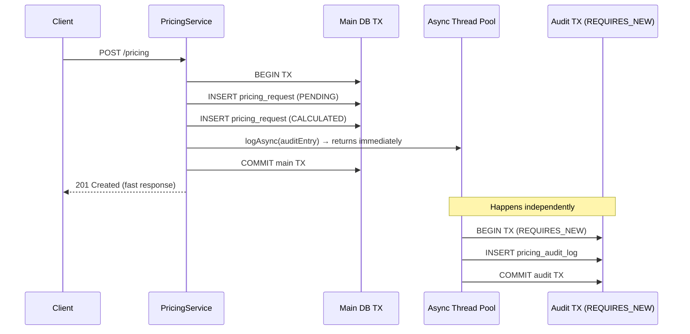

# Audit Trail Feature

**Implemented In:** `PricingAuditService`, `PricingAuditLog`, `PricingAuditRepository`
**Status:** ✅ Implemented (with noted production hardening gaps)

---

## Overview

The Audit Trail is an **immutable, append-only record** of all significant business events in the ePricing system. Every pricing calculation, rejection, approval, and error produces at least one audit log entry.

---

## Business Purpose

In banking, an audit trail is not optional — it is a regulatory requirement. The audit trail enables:

1. **Compliance**: Demonstrate to RBI that every pricing decision was recorded.
2. **Customer disputes**: "Why was my loan rate 8.50% on Jan 15th?" → query audit log.
3. **Fraud investigation**: "Did someone process 500 pricing requests for CUST999 in 10 minutes?" → query by customer + time range.
4. **Performance analysis**: "What's the average processing time per product type?" → query `duration_ms`.
5. **Incident post-mortems**: Correlate audit records with traces and metrics to reconstruct what happened.

---

## What Gets Audited

| Event | Action | Outcome |
|---|---|---|
| Pricing calculation requested | `PRICING_REQUESTED` | N/A |
| Pricing calculated successfully | `PRICING_CALCULATED` | `SUCCESS` |
| Customer rejected (credit score) | `PRICING_REJECTED` | `REJECTED` |
| Customer rejected (income limit) | `PRICING_REJECTED` | `REJECTED` |
| Technical error during calculation | `PRICING_ERROR` | `FAILURE` |
| Pricing approved (manual/auto) | `PRICING_APPROVED` | `SUCCESS` |

Each audit record includes:
- The `pricingRequestId` linking to the pricing result
- `traceId` for cross-referencing with distributed traces
- `durationMs` for performance tracking
- `requestIp` for security and fraud analysis

---

## Async Design (Why It Matters)



**Client sees fast response.** Audit writing does not block the API.

---

## Transactional Isolation

`@Transactional(propagation = Propagation.REQUIRES_NEW)` in `PricingAuditService`:

| Scenario | Main TX | Audit TX |
|---|---|---|
| Normal pricing | ✅ COMMIT | ✅ COMMIT |
| Main TX rollback (rare) | ❌ ROLLBACK | ✅ COMMIT (independent) |
| Audit write failure | ✅ COMMIT | ❌ ROLLBACK (logged, not retried) |

Audit records survive main transaction rollbacks — critical for compliance.

---

## Querying the Audit Trail

Via `PricingAuditRepository`:

```java
// Full history for a pricing request (chronological)
List<PricingAuditLog> history =
    auditRepository.findByPricingRequestIdOrderByCreatedAtAsc(requestId);

// Customer activity in last 30 days (fraud investigation)
List<PricingAuditLog> activity =
    auditRepository.findByCustomerIdAndCreatedAtBetweenOrderByCreatedAtDesc(
        customerId, startDate, endDate
    );

// Find audit by trace ID (cross-reference with distributed trace)
List<PricingAuditLog> traceEvents =
    auditRepository.findByTraceIdOrderByCreatedAtAsc(traceId);

// Count failures in last hour
Long failures = auditRepository.countFailuresSince(oneHourAgo);

// Find slow operations above 500ms threshold
List<PricingAuditLog> slowOps =
    auditRepository.findSlowOperations(500L, sixHoursAgo);
```

---

## Production Hardening Gaps

| Gap | Risk | Mitigation |
|---|---|---|
| `delete()` methods not removed from `PricingAuditRepository` | Accidental audit deletion | Custom base repository removing delete methods |
| No database-level `INSERT-only` constraint | Audit tampering | DB role with `GRANT INSERT, SELECT` only |
| No encryption of sensitive audit fields | PII exposure in DB | Column-level encryption or field-level encryption |
| Async failures not retried | Lost audit record | Dead-letter queue for failed async tasks |
| No long-term archival | Compliance (7-year retention) | S3 archival pipeline for records > 90 days |

---

## Audit Log Data Example

```json
{
  "id": 42,
  "pricing_request_id": 101,
  "customer_id": "CUST001234",
  "action": "PRICING_CALCULATED",
  "description": "HOME_LOAN pricing calculated at 8.00% p.a. EMI: ₹41,822 for 240 months",
  "performed_by": "system:pricing-engine",
  "outcome": "SUCCESS",
  "request_ip": "203.0.113.195",
  "trace_id": "abc123def456789",
  "duration_ms": 142,
  "created_at": "2024-01-15T10:30:00.142"
}
```

---

## Cross-References

- [PricingAuditService.md](../services/PricingAuditService.md) — service implementation
- [PricingAuditLog.md](../entities/PricingAuditLog.md) — entity schema
- [PricingAuditRepository.md](../repositories/PricingAuditRepository.md) — queries
- [WebConfig.md](../configuration/WebConfig.md) — async thread pool
- [OpenTelemetry.md](../monitoring/OpenTelemetry.md) — trace correlation via traceId
