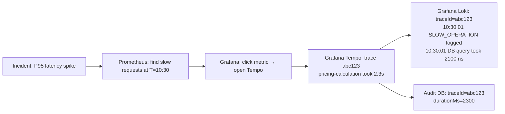

# Observability Feature

**Status:** ✅ Fully Implemented (Tempo integration partial)

---

## Overview

Observability is a first-class feature of the ePricing service, not an afterthought. The system implements all three pillars of modern observability:

1. **Metrics** — quantitative, aggregatable system measurements
2. **Logs** — timestamped, structured event records
3. **Traces** — distributed request timeline across service boundaries

All three signals are **correlated by `traceId`**, enabling root-cause analysis from any starting point.

---

## The Three Pillars

### Pillar 1: Metrics

**Stack:** Micrometer → Prometheus → Grafana

Metrics answer: *"Is the system healthy right now and over time?"*

**Auto-instrumented metrics:**
- HTTP request rates, latencies (percentiles), error rates (Spring MVC)
- JVM heap, GC, thread counts (JVM auto-instrumentation)
- HikariCP DB connection pool (HikariCP integration)
- Tomcat thread pool (embedded Tomcat)
- Disk space, system CPU

**Custom business metrics (PricingMetrics):**
- `pricing_requests_total{type}` — success/failure/rejection counters
- `pricing_requests_active` — in-flight request gauge
- `pricing_calculation_duration_seconds` — calculation latency timer
- `pricing_loan_amount_requested_rupees` — loan amount distribution
- `pricing_product_requests{product}` — by-product request counters

**Prometheus scrape:** `:8081/actuator/prometheus` every 10s

**Grafana PromQL examples:**
```promql
# Error rate
rate(http_server_requests_seconds_count{status=~"5.."}[5m])
  / rate(http_server_requests_seconds_count[5m]) * 100

# P95 latency
histogram_quantile(0.95, rate(pricing_calculation_duration_seconds_bucket[5m]))

# Approval rate
rate(pricing_requests_total{type="success"}[5m])
  / rate(pricing_requests_total{type="all"}[5m]) * 100
```

---

### Pillar 2: Logs

**Stack:** Logback (JSON) → File → Promtail → Loki → Grafana

Logs answer: *"What exactly happened during this request?"*

**Log format:** Structured JSON via `LogstashEncoder`. Every log line includes:
```json
{
  "@timestamp": "2024-01-15T10:30:00.000+05:30",
  "level": "INFO",
  "message": "Pricing calculation completed",
  "traceId": "abc123def456",
  "spanId": "789xyz",
  "customerId": "CUST001234",
  "requestId": "REQ-ABC123",
  "event_type": "PRICING_COMPLETED",
  "application": "epricing-service"
}
```

**Context injection:** `MDCFilter` populates `requestId`, `customerId`, `clientIp` into MDC at the start of every request. OTel bridge adds `traceId` and `spanId`.

**Event types (StructuredLogger):**
- `PRICING_STARTED` — request received
- `PRICING_COMPLETED` — rate calculated
- `PRICING_REJECTED` — eligibility failure
- `PRICING_ERROR` — technical error
- `AUDIT_EVENT` — regulatory audit events
- `SLOW_OPERATION` — operations > 500ms
- `VALIDATION_FAILURE` — DTO validation errors
- `DATABASE_ERROR` — DB operation failures

**LogQL query examples:**
```logql
# All errors
{application="epricing-service"} | json | level="ERROR"

# One customer's journey
{application="epricing-service"} | json | customerId="CUST001234"

# Trace correlation
{application="epricing-service"} | json | traceId="abc123def456"
```

---

### Pillar 3: Traces

**Stack:** OTel SDK → OTLP HTTP → OTel Collector → Grafana Tempo (partial)

Traces answer: *"Where did this specific request spend its time?"*

**Auto-instrumented spans:**
- HTTP server span (root span for each request)
- JDBC spans (each DB query as a child span)
- HTTP client spans (outbound HTTP calls)

**Custom child span (PricingService):**
```
POST /api/v1/pricing [201] [142ms]
  └── pricing-calculation [89ms]
        attributes: customer.id, product.type, loan.amount, credit.score
        ├── SELECT pricing_requests [3ms]
        ├── INSERT pricing_requests (PENDING) [12ms]
        └── INSERT pricing_requests (CALCULATED) [18ms]
```

**Context propagation:** W3C TraceContext headers (`traceparent`, `tracestate`). If an upstream service calls epricing-service with a `traceparent` header, epricing spans are created as children of the upstream trace.

---

## Signal Correlation

The `traceId` is the **correlation key** between all three signals:



**In Grafana:** Derived fields in the Loki datasource make `traceId` values in logs clickable, opening the trace in Grafana Tempo. The trace-to-metrics feature allows jumping from a trace to a metrics panel filtered by time.

---

## Alerting

8 Prometheus alerting rules covering:
- Service availability (`EPricingServiceDown`)
- Error rates (`EPricingHighErrorRate`)
- Latency SLO (`EPricingHighLatency` — 2s P95, per RBI guidelines)
- Business metrics (`EPricingHighRejectionRate` > 20%)
- Infrastructure (`EPricingHighCPU`, `EPricingHighHeapUsage`, `EPricingDBConnectionPoolLow`, `EPricingRequestBacklog`)

See [AlertingRules.md](../monitoring/AlertingRules.md) for full definitions.

---

## Traffic Generator

The `traffic-generator` service in `docker-compose.yml` continuously sends requests every 2 seconds, populating all Grafana dashboard panels with realistic live data:
- `POST /api/v1/pricing` (HOME_LOAN and AUTO_LOAN)
- `GET /api/v1/metrics-demo/simulate-slow`
- `GET /api/v1/metrics-demo/simulate-error`
- `GET /api/v1/metrics-demo/generate-load`

---

## Cross-References

- [PricingMetrics.md](../monitoring/PricingMetrics.md) — custom Micrometer metric definitions
- [LoggingStrategy.md](../logging/LoggingStrategy.md) — structured logging implementation
- [OpenTelemetry.md](../monitoring/OpenTelemetry.md) — trace pipeline
- [Prometheus.md](../monitoring/Prometheus.md) — metric storage
- [Grafana.md](../monitoring/Grafana.md) — visualization
- [Loki.md](../monitoring/Loki.md) — log storage
- [AlertingRules.md](../monitoring/AlertingRules.md) — alerting configuration
