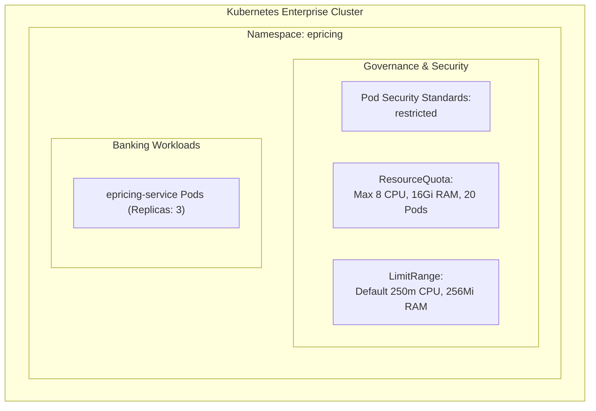

# Enterprise Kubernetes Namespace & RBAC Architecture

**Domain:** Kubernetes Multi-Tenancy, Governance, and Access Control  
**Namespace:** `epricing`  
**Manifest Files:** [`k8s/00-namespace.yml`](../../k8s/00-namespace.yml), [`k8s/01-rbac.yml`](../../k8s/01-rbac.yml)  

---

## 1. Enterprise Namespace Architecture (`k8s/00-namespace.yml`)

The `epricing` namespace isolates all loan pricing workloads from other banking domains (e.g. accounts, payments, auth):



### Key Governance Policies

1. **Pod Security Standards (`restricted`):**
   - Enforces non-root container execution (`runAsNonRoot: true`).
   - Disallows privilege escalation (`allowPrivilegeEscalation: false`).
   - Drops all Linux kernel capabilities (`capabilities: drop: ["ALL"]`).
   - Read-only root filesystem where applicable.
2. **ResourceQuota (`epricing-quota`):**
   - Guarantees the pricing service cannot consume runaway cluster resources and starve other banking microservices.
   - Caps total requests to `4 CPU` / `8Gi RAM` and limits to `8 CPU` / `16Gi RAM`.
3. **LimitRange (`epricing-limit-range`):**
   - Injects sensible defaults so any container without explicit memory/CPU requests automatically receives `250m CPU` and `256Mi RAM`.

---

## 2. Role-Based Access Control (RBAC) (`k8s/01-rbac.yml`)

### Least-Privilege Identity Matrix

| Subject / Identity | Bound Role | Permissions | Business Justification |
| :--- | :--- | :--- | :--- |
| **`epricing-service-sa`**<br>(Application Pods) | `epricing-service-role` | `get`, `list`, `watch` on `configmaps`, `endpoints` | Required for Spring Cloud Kubernetes / runtime config discovery without granting cluster-admin privileges. |
| **`bank:developers`**<br>(L2 Support / Devs) | `epricing-developer-role` | `get`, `list`, `watch` on `pods`, `pods/log`, `events`, `services`, `deployments`<br>`create` on `pods/port-forward` | Allows engineers to stream logs and troubleshoot incidents while strictly blocking destructive operations (`delete`, `patch`, `exec`). |
| **`prometheus-k8s`**<br>(Monitoring Namespace) | `epricing-prometheus-scraper-role` | `get`, `list`, `watch` on `pods`, `services`, `endpoints` | Permits Prometheus to auto-discover and scrape `/actuator/prometheus` on port `:8081`. |

---

## 3. Deployment & Verification Commands

### Apply Manifests
```bash
# 1. Create Namespace, Quotas, and Limits
kubectl apply -f k8s/00-namespace.yml

# 2. Apply ServiceAccount, Roles, and RoleBindings
kubectl apply -f k8s/01-rbac.yml
```

### Verify Governance & Quotas
```bash
# Check namespace labels and PSS compliance
kubectl describe namespace epricing

# Inspect active quotas
kubectl describe resourcequota epricing-quota -n epricing

# Inspect limit ranges
kubectl describe limitrange epricing-limit-range -n epricing
```

### Test RBAC Permissions (`kubectl auth can-i`)
```bash
# Test if application ServiceAccount can read configmaps (Should be: yes)
kubectl auth can-i get configmaps --as=system:serviceaccount:epricing:epricing-service-sa -n epricing

# Test if application ServiceAccount can delete pods (Should be: no)
kubectl auth can-i delete pods --as=system:serviceaccount:epricing:epricing-service-sa -n epricing

# Test if developer group can view logs (Should be: yes)
kubectl auth can-i get pods/log --as=alice --as-group=bank:developers -n epricing

# Test if developer group can delete deployments (Should be: no)
kubectl auth can-i delete deployments --as=alice --as-group=bank:developers -n epricing
```

---

## 4. Cross-References

- [KubernetesDeployment.md](./KubernetesDeployment.md) — Full workload deployment overview
- [Security.md](../security/Security.md) — Enterprise authentication and encryption strategy
- [enterprise-infrastructure-ld-tracker.csv](../enterprise-infrastructure-ld-tracker.csv) — Task tracking for LD-01 to LD-03
