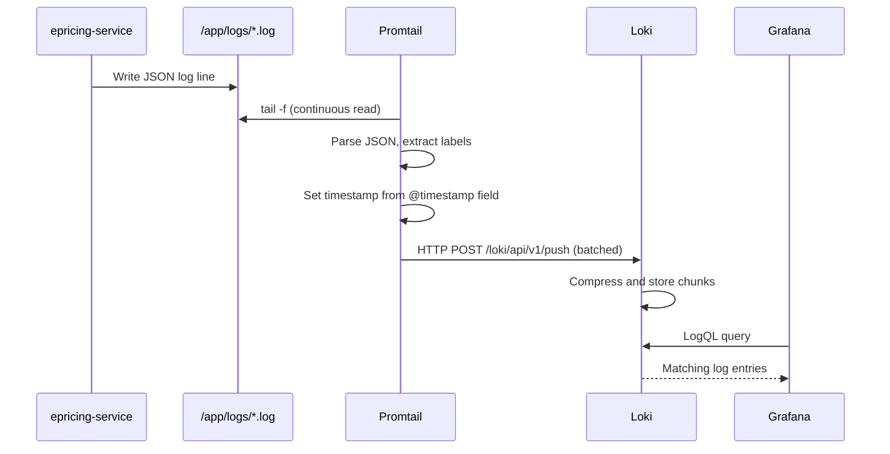

# Loki — Log Aggregation

**File:** [`loki-config.yml`](../../loki-config.yml)
**Container Image:** `grafana/loki:3.1.0`
**Port:** `3100`

---

## Purpose

Loki is the **log aggregation system** in the ePricing observability stack. It receives structured JSON logs from Promtail and makes them queryable in Grafana using LogQL.

**Why Loki over Elasticsearch?**

| Feature | Loki | Elasticsearch |
|---|---|---|
| Indexing strategy | Indexes only labels (low cardinality) | Indexes all fields in every log line |
| Storage cost | ~10x lower (compressed chunks) | High — full-text inverted index |
| Compute | Low — query-time extraction | High — real-time indexing |
| Query language | LogQL (similar to PromQL) | Lucene / KQL |
| Integration | Native Grafana datasource | Kibana (separate tool) |

Loki is the right choice when logs are already structured (JSON) and queries are label-based (filtering by `application`, `level`, `traceId`).

---

## Configuration

```yaml
auth_enabled: false         # No auth in dev — enable in production

server:
  http_listen_port: 3100

common:
  path_prefix: /loki
  storage:
    filesystem:
      chunks_directory: /loki/chunks
      rules_directory: /loki/rules
  replication_factor: 1     # Single-node (dev) — use 3 for production HA

schema_config:
  configs:
    - from: 2020-10-24
      store: tsdb
      object_store: filesystem
      schema: v13
      index:
        prefix: index_
        period: 24h

limits_config:
  retention_period: 168h    # 7 days of log retention
  ingestion_rate_mb: 16
  max_streams_per_user: 10000

compactor:
  working_directory: /loki/compactor
  compaction_interval: 10m
  retention_enabled: true
```

---

## Data Model

### Streams

Loki organises logs into **streams** — a unique combination of labels. Each stream has its own compressed block of log lines.

For ePricing logs, Promtail creates streams with labels:
- `{application="epricing-service", level="INFO", job="epricing-service-logs"}`
- `{application="epricing-service", level="ERROR", job="epricing-service-logs"}`
- `{application="epricing-service", level="WARN", job="epricing-service-logs"}`

**Cardinality warning:** Adding high-cardinality labels (like `traceId` with millions of unique values) creates millions of streams, causing performance degradation. In the Promtail configuration, `traceId` is configured as a label but should be treated carefully in production with many unique values.

### Log Entries

Each log entry = `{timestamp, labels, log line}`. For ePricing, the log line is the raw JSON from Logback, and Grafana uses `| json` to extract fields at query time.

---

## Log Pipeline (Promtail → Loki)



**File:** [`promtail-config.yml`](../../promtail-config.yml)

Promtail's pipeline stages:
1. **`json`** — Parse the entire log line as JSON
2. **`labels`** — Extract `level`, `application`, `traceId` as Loki label dimensions
3. **`timestamp`** — Set the Loki timestamp from the log's `@timestamp` field (not the shipping time)
4. **`output`** — Set the log message to the parsed `message` field (cleaner Grafana display)

---

## LogQL Query Language

### Filter by label

```logql
{application="epricing-service"}
```

### Filter by label + content

```logql
{application="epricing-service"} |= "PRICING_REJECTED"
```

### JSON field extraction + filter

```logql
{application="epricing-service"} | json | level="ERROR"
```

### Filter by customer

```logql
{application="epricing-service"} | json | customerId="CUST001234"
```

### Filter by trace ID (log-trace correlation)

```logql
{application="epricing-service"} | json | traceId="abc123def456"
```

### Count errors per minute (metric query)

```logql
count_over_time(
  {application="epricing-service"} | json | level="ERROR" [1m]
)
```

### Rate of slow operations

```logql
rate(
  {application="epricing-service"} | json | event_type="SLOW_OPERATION" [5m]
)
```

---

## Retention

```yaml
limits_config:
  retention_period: 168h   # 7 days
```

After 7 days, the compactor deletes old chunks. In production banking:
- Increase retention to at least 90 days for operational logs
- Archive audit logs to long-term storage (S3/GCS) — banking regulations may require 7 years

---

## Cross-References

- [LoggingStrategy.md](../logging/LoggingStrategy.md) — how JSON logs are generated
- [DockerCompose.md](../docker/DockerCompose.md) — Loki and Promtail container setup
- [Grafana.md](./Grafana.md) — Loki as a Grafana datasource
