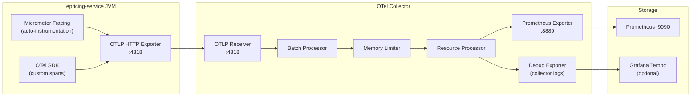

# OpenTelemetry — Distributed Tracing Pipeline

**File:** [`otel-collector-config.yml`](../../otel-collector-config.yml)
**Container Image:** `otel/opentelemetry-collector-contrib:0.107.0`
**Ports:** `4317` (gRPC), `4318` (HTTP), `8888` (collector metrics), `8889` (Prometheus exporter)

---

## Purpose

OpenTelemetry (OTel) is the **observability telemetry standard**. In the ePricing stack, it serves two roles:

1. **OTel SDK (in-app)** — the Spring Boot application uses the OTel Java SDK to create, annotate, and export spans (traces).
2. **OTel Collector (infrastructure)** — a standalone service that receives OTLP telemetry from the app, processes it, and fans out to multiple backends.

---

## Architecture



---

## OTel SDK in Spring Boot

### Dependencies

```xml
<dependency>
    <groupId>io.opentelemetry</groupId>
    <artifactId>opentelemetry-api</artifactId>          <!-- API contracts -->
</dependency>
<dependency>
    <groupId>io.opentelemetry</groupId>
    <artifactId>opentelemetry-sdk</artifactId>          <!-- SDK implementation -->
</dependency>
<dependency>
    <groupId>io.opentelemetry</groupId>
    <artifactId>opentelemetry-exporter-otlp</artifactId> <!-- OTLP export -->
</dependency>
<dependency>
    <groupId>io.opentelemetry</groupId>
    <artifactId>opentelemetry-sdk-extension-autoconfigure</artifactId> <!-- Env var config -->
</dependency>
<dependency>
    <groupId>io.micrometer</groupId>
    <artifactId>micrometer-tracing-bridge-otel</artifactId> <!-- Bridge Micrometer ↔ OTel -->
</dependency>
```

### Auto-Instrumentation

`opentelemetry-spring-webmvc-6.0` automatically creates a root span for every HTTP request:
- `http.method`, `http.url`, `http.status_code` as span attributes
- W3C TraceContext header propagation (`traceparent`, `tracestate`)
- Hibernate JDBC spans for every database query

### Custom Spans

`PricingService` creates a `pricing-calculation` child span:

```java
Span span = tracer.spanBuilder("pricing-calculation")
    .setAttribute("customer.id", dto.getCustomerId())
    .setAttribute("product.type", dto.getProductType())
    .setAttribute("loan.amount", dto.getLoanAmount().longValue())
    .startSpan();
try (Scope scope = span.makeCurrent()) {
    // business logic
    span.setStatus(StatusCode.OK);
} catch (Exception e) {
    span.setStatus(StatusCode.ERROR, e.getMessage());
    span.recordException(e);
    throw e;
} finally {
    span.end();
}
```

---

## OTel Collector Configuration

**File:** [`otel-collector-config.yml`](../../otel-collector-config.yml)

### Receivers

```yaml
receivers:
  otlp:
    protocols:
      grpc:
        endpoint: 0.0.0.0:4317
      http:
        endpoint: 0.0.0.0:4318     # Used by epricing-service (http/protobuf)

  prometheus:
    config:
      scrape_configs:
        - job_name: 'epricing-via-otel-collector'
          static_configs:
            - targets: ['epricing-service:8081']
          metrics_path: '/actuator/prometheus'
```

Dual receivers:
- **OTLP**: receives traces and pushed metrics from the app.
- **Prometheus**: also scrapes `/actuator/prometheus` (redundancy).

### Processors

```yaml
processors:
  batch:
    timeout: 5s
    send_batch_size: 1000       # Batch up to 1000 spans before exporting
    send_batch_max_size: 2000

  memory_limiter:
    check_interval: 5s
    limit_mib: 512              # Start throttling at 512MB
    spike_limit_mib: 128        # Drop data above 640MB

  resource:
    attributes:
      - key: service.environment
        value: "docker-local"
        action: upsert
```

The **batch processor** is critical for performance: without it, every span generates an individual HTTP export call. Batching reduces overhead from thousands of requests to hundreds.

The **memory limiter** provides graceful degradation — the collector drops data instead of crashing when under memory pressure.

### Exporters

```yaml
exporters:
  debug:
    verbosity: basic            # Print telemetry to collector logs (dev)

  prometheus:
    endpoint: "0.0.0.0:8889"   # Prometheus scrapes this for business metrics
    namespace: epricing         # Prefix: epricing_pricing_requests_total
    send_timestamps: true
```

The **Prometheus exporter** re-exposes metrics received via OTLP in Prometheus text format. Prometheus scrapes `:8889` (job: `otel-metrics-from-collector`).

### Pipelines

```yaml
service:
  pipelines:
    traces:
      receivers: [otlp]
      processors: [memory_limiter, batch, resource]
      exporters: [debug]              # Add otlp/tempo for Grafana Tempo

    metrics:
      receivers: [otlp, prometheus]
      processors: [memory_limiter, batch, resource]
      exporters: [prometheus, debug]

    logs:
      receivers: [otlp]
      processors: [memory_limiter, batch]
      exporters: [debug]
```

---

## Trace Correlation with Logs

OTel automatically populates `traceId` and `spanId` into MDC (via `micrometer-tracing-bridge-otel`). The `logback-spring.xml` includes these MDC keys in every JSON log line:

```json
{
  "message": "Pricing calculation completed",
  "traceId": "abc123def456",
  "spanId": "789xyz",
  "customerId": "CUST001234"
}
```

**In Grafana:** Query Loki for `traceId="abc123def456"` to see all logs from a specific distributed trace.

---

## Grafana Tempo Integration

> **Status: Not fully configured.** The OTel Collector config has a commented-out Tempo exporter. To enable:

```yaml
exporters:
  otlp/tempo:
    endpoint: tempo:4317
    tls:
      insecure: true

service:
  pipelines:
    traces:
      exporters: [debug, otlp/tempo]    # Add otlp/tempo
```

And add `grafana/tempo` service to `docker-compose.yml`.

---

## Sampling Strategy

```yaml
management:
  tracing:
    sampling:
      probability: 1.0   # 100% in dev
```

| Environment | Recommended Sampling |
|---|---|
| Development | `1.0` (100%) |
| Staging | `0.1` (10%) |
| Production | `0.01`–`0.1` (1–10%) |
| Large transactions | Custom sampler: always trace |

---

## Cross-References

- [OpenTelemetryConfig.md](../configuration/OpenTelemetryConfig.md) — OTel SDK initialization in Spring Boot
- [LoggingStrategy.md](../logging/LoggingStrategy.md) — traceId in log MDC
- [Prometheus.md](./Prometheus.md) — consumes metrics from OTel Collector
- [DockerCompose.md](../docker/DockerCompose.md) — OTel Collector container
