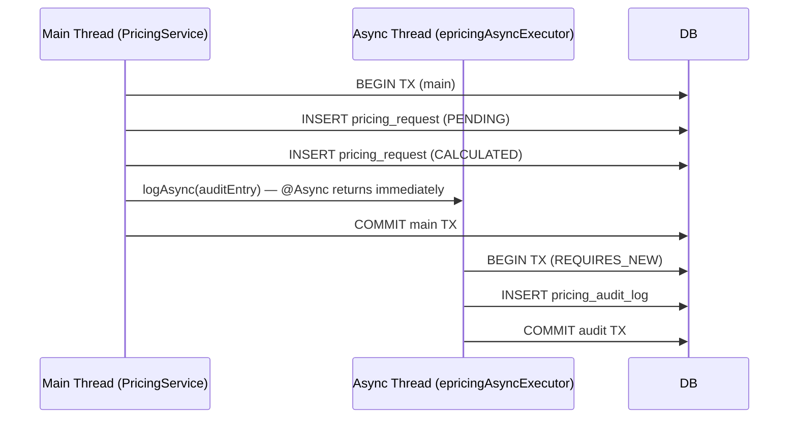

# PricingAuditService

**Package:** `com.bank.epricing.service`
**File:** [`PricingAuditService.java`](../../src/main/java/com/bank/epricing/service/PricingAuditService.java)
**Stereotype:** `@Service`

---

## Purpose

`PricingAuditService` writes **immutable audit log entries** for every pricing operation. It is deliberately decoupled from the main request path in two ways:

1. **Asynchronous execution** — runs on a separate thread pool so it never adds latency to customer-facing API responses.
2. **Independent transaction** — uses `@Transactional(propagation = REQUIRES_NEW)` so audit records are persisted even if the main business transaction rolls back.

---

## Design Principles

### Why Async?

In a high-throughput banking API, synchronous audit logging would add DB write latency to every response. At 1000 TPS, even a 10ms audit write adds 10 seconds of aggregate latency per second. By offloading to a separate thread (from the `epricingAsyncExecutor` pool), the request thread is unblocked immediately after the pricing calculation completes.

### Why `REQUIRES_NEW`?

Scenario: A pricing calculation succeeds and saves to the main DB. Then some downstream operation fails and the main transaction rolls back. The audit record **must still exist** to satisfy regulatory requirements.

`REQUIRES_NEW` suspends the calling thread's transaction (if any) and opens a brand-new, independent transaction. This guarantee ensures audit records are always written, even when the main business transaction fails.



---

## Methods

### `logAsync(PricingAuditLog auditLog) → void`

```java
@Async("epricingAsyncExecutor")
@Transactional(propagation = Propagation.REQUIRES_NEW)
public void logAsync(PricingAuditLog auditLog) {
    auditRepository.save(auditLog);
}
```

- `@Async("epricingAsyncExecutor")` — executes on the `epricingAsyncExecutor` thread pool defined in `WebConfig`. Without the named executor, Spring would use `SimpleAsyncTaskExecutor` (a new thread per call — no pooling).
- `@Transactional(propagation = REQUIRES_NEW)` — always opens a new DB transaction.
- Returns `void` — fire-and-forget pattern. `PricingService` does not wait for the result.

---

## Thread Pool Configuration

The async executor is configured in [`WebConfig.java`](../../src/main/java/com/bank/epricing/config/WebConfig.java):

| Setting | Value | Reason |
|---|---|---|
| `corePoolSize` | 5 | Always-on threads ready to accept audit tasks |
| `maxPoolSize` | 20 | Max threads under heavy burst (I/O-bound) |
| `queueCapacity` | 100 | Queue depth before spawning new threads |
| `threadNamePrefix` | `epricing-async-` | Named threads — appear in thread dumps |
| `waitForTasksToCompleteOnShutdown` | `true` | Graceful shutdown — no lost audit logs |
| `awaitTerminationSeconds` | 30 | Max wait on app shutdown |

Threads appear in JVM thread dumps as `epricing-async-1`, `epricing-async-2`, etc. This makes identifying audit-writing threads trivial during incident investigation.

---

## Audit Log Content

The calling code in `PricingService` builds the `PricingAuditLog` entity before calling `logAsync`. Typical audit entry:

| Field | Example |
|---|---|
| `pricingRequestId` | `101` |
| `customerId` | `CUST001234` |
| `action` | `PRICING_CALCULATED` |
| `description` | `Interest rate 8.50% p.a. calculated for HOME_LOAN of ₹5000000` |
| `performedBy` | `system:pricing-engine` |
| `outcome` | `SUCCESS` |
| `traceId` | `abc123def456` |
| `requestIp` | `192.168.1.1` |
| `durationMs` | `142` |

---

## Audit Repository

`PricingAuditService` depends on `PricingAuditRepository`. See [PricingAuditRepository.md](../repositories/PricingAuditRepository.md) for query details.

---

## Error Handling in Async Context

Since `logAsync` runs on a separate thread, exceptions are **not propagated** back to the HTTP response. Spring's `@Async` infrastructure wraps the future; any uncaught exception is logged by Spring's default `AsyncUncaughtExceptionHandler`. In production, you would configure a custom `AsyncUncaughtExceptionHandler` to:

1. Alert the on-call team (critical: audit failure in banking = compliance risk).
2. Retry the write (idempotent due to unique trace IDs).

---

## Cross-References

- [PricingService.md](./PricingService.md) — how `logAsync` is invoked
- [PricingAuditRepository.md](../repositories/PricingAuditRepository.md) — persistence queries
- [PricingAuditLog.md](../entities/PricingAuditLog.md) — entity schema
- [WebConfig.md](../configuration/WebConfig.md) — thread pool configuration
- [AuditTrail.md](../features/AuditTrail.md) — feature documentation
