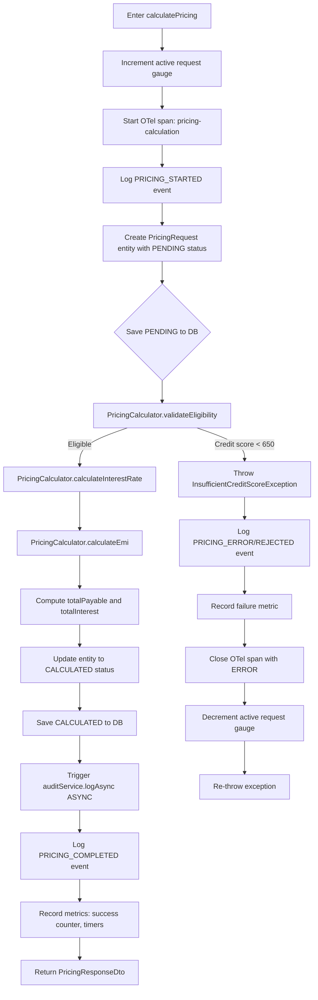

# PricingService

**Package:** `com.bank.epricing.service`
**File:** [`PricingService.java`](../../src/main/java/com/bank/epricing/service/PricingService.java)
**Stereotype:** `@Service`, `@Transactional`

---

## Purpose

`PricingService` is the **central business orchestrator** of the ePricing system. It:

1. Accepts raw DTO input from `PricingController`.
2. Validates customer eligibility (credit score, loan-to-income).
3. Delegates mathematical pricing to `PricingCalculator`.
4. Persists the pricing request to the database (via `PricingRepository`).
5. Dispatches an asynchronous audit log entry (via `PricingAuditService`).
6. Records observability data: OTel spans, Micrometer metrics, structured log events.

---

## Constructor Dependencies

```java
public PricingService(
    PricingRepository pricingRepository,
    PricingCalculator pricingCalculator,
    PricingMetrics pricingMetrics,
    PricingAuditService auditService,
    StructuredLogger structuredLogger,
    Tracer tracer
)
```

All dependencies are injected via constructor injection (best practice — explicit, testable).

| Dependency | Role |
|---|---|
| `PricingRepository` | Save/retrieve `PricingRequest` JPA entities |
| `PricingCalculator` | Pure math: interest rate, EMI, risk category |
| `PricingMetrics` | Record Micrometer counters, timers, gauges |
| `PricingAuditService` | Trigger async audit log write |
| `StructuredLogger` | Emit typed, structured log events |
| `Tracer` | Create custom OTel child spans |

---

## Public API

### `calculatePricing(PricingRequestDto dto, String clientIp) → PricingResponseDto`

The primary business method. Called by `PricingController` for every `POST /pricing` request.

**Execution flow:**



**Business rules applied (delegated to `PricingCalculator`):**

- Minimum credit score: 650
- Maximum loan amount: 60% of annual income
- Credit score adjustments: ±0.50% to ±1.50% on base rate
- Large loan discount: −0.25% for amounts ≥ ₹50 lakh

**Transaction behaviour:** The method is annotated `@Transactional`. Both `save(pendingRequest)` and `save(calculatedRequest)` run within a single DB transaction. If the second save fails, both are rolled back. The audit log runs in a **separate** transaction (`REQUIRES_NEW`) so it is never rolled back with the main TX.

---

### `getPricingHistory(String customerId) → List<PricingResponseDto>`

Returns pricing history. If `customerId` is blank/null, returns the 10 most-recent records via `findTop10ByOrderByCreatedAtDesc()`.

```java
if (customerId == null || customerId.isBlank()) {
    return repository.findTop10ByOrderByCreatedAtDesc()
        .stream().map(this::mapToResponseDto).toList();
}
return repository.findByCustomerId(customerId)
    .stream().map(this::mapToResponseDto).toList();
```

---

### `getPricingById(Long id) → PricingResponseDto`

Retrieves a single pricing record by primary key. Throws `PricingException.PricingNotFoundException` if not found.

---

## Observability in PricingService

### OpenTelemetry Tracing

Every call to `calculatePricing` creates a custom **child span**:

```java
Span span = tracer.spanBuilder("pricing-calculation")
    .setAttribute("customer.id", dto.getCustomerId())
    .setAttribute("product.type", dto.getProductType())
    .setAttribute("loan.amount", dto.getLoanAmount().longValue())
    .startSpan();
```

On success, `span.setStatus(StatusCode.OK)` is called. On error, `span.setStatus(StatusCode.ERROR, message)` is called before the span is ended in the `finally` block.

### Micrometer Metrics

| Metric call | Effect |
|---|---|
| `metrics.incrementActiveRequests()` | `pricing_requests_active` gauge +1 |
| `metrics.recordPricingRequestReceived()` | `pricing_requests_total{type="all"}` +1 |
| `metrics.recordProductTypeRequest(productType)` | `pricing_product_requests{product=...}` +1 |
| `metrics.recordLoanAmount(amount)` | `pricing_loan_amount_requested_rupees` distribution update |
| `metrics.recordPricingSuccess()` | `pricing_requests_total{type="success"}` +1 |
| `metrics.stopCalculationTimer(sample)` | `pricing_calculation_duration_seconds` observation recorded |
| `metrics.recordEndToEndDuration(sample)` | `pricing_request_end_to_end_duration_seconds` observation |
| `metrics.decrementActiveRequests()` | `pricing_requests_active` gauge -1 |

### Structured Logging

| Call | Event logged |
|---|---|
| `structuredLogger.logPricingStarted(...)` | `event_type=PRICING_STARTED` at INFO |
| `structuredLogger.logPricingCompleted(...)` | `event_type=PRICING_COMPLETED` at INFO |
| `structuredLogger.logPricingRejected(...)` | `event_type=PRICING_REJECTED` at WARN |
| `structuredLogger.logPricingError(...)` | `event_type=PRICING_ERROR` at ERROR |

---

## Error Handling

`PricingService` does not swallow exceptions. It enriches the observability signals and re-throws:

```java
} catch (PricingException e) {
    span.setStatus(StatusCode.ERROR, e.getMessage());
    metrics.recordPricingRejection();   // or recordPricingFailure()
    structuredLogger.logPricingRejected(...);
    throw e;  // propagated → GlobalExceptionHandler
}
```

`GlobalExceptionHandler` then maps `PricingException` subtypes to appropriate HTTP status codes.

---

## Private Helper: `mapToResponseDto`

Maps a `PricingRequest` JPA entity to a `PricingResponseDto` for API responses. This ensures the entity is never exposed directly to the API layer.

---

## Transaction Strategy Summary

| Operation | Transaction |
|---|---|
| Save PENDING request | Main `@Transactional` |
| Run calculations | In-memory, no TX needed |
| Save CALCULATED request | Main `@Transactional` |
| Audit log write | Separate `REQUIRES_NEW` TX (async thread) |

---

## Cross-References

- [PricingCalculator.md](../utilities/PricingCalculator.md) — mathematical implementations
- [PricingAuditService.md](./PricingAuditService.md) — audit log strategy
- [PricingMetrics.md](../monitoring/PricingMetrics.md) — custom metric definitions
- [ExceptionHandling.md](../exception-handling/ExceptionHandling.md) — error mapping
- [PricingController.md](../controllers/PricingController.md) — how this service is invoked
